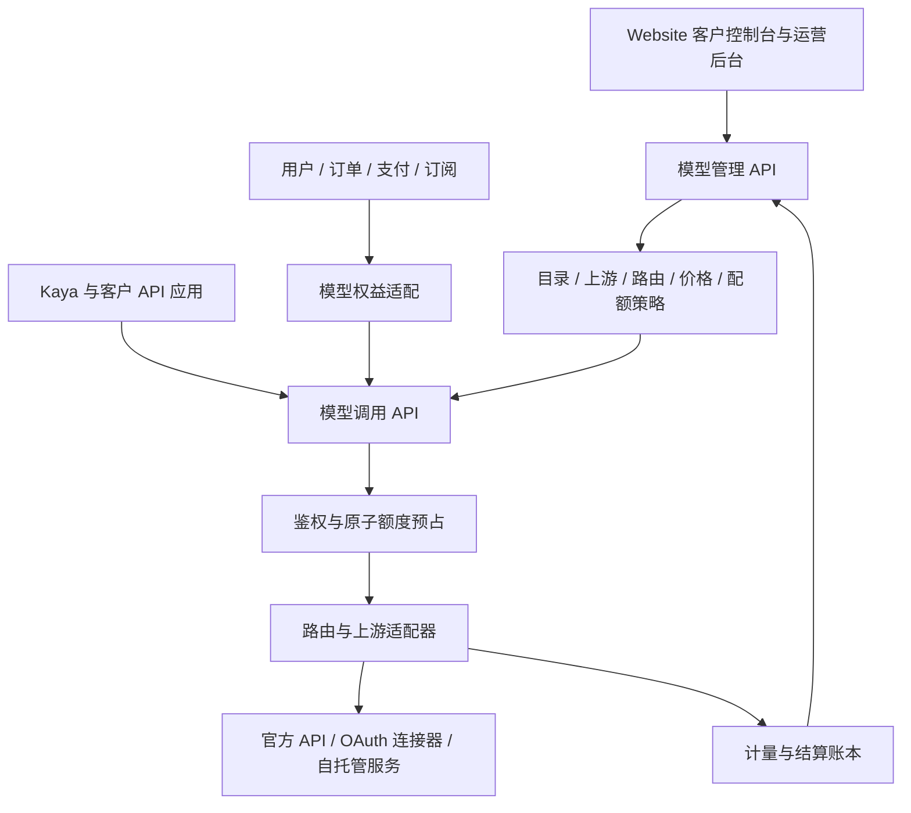

# Kaya Coding Plan：模型 API 产品设计

日期：2026-09-08  
分支：`kaya-coding-plan`  
实现仓库：`yunhou-users`  
界面仓库：`../yunhou-Website`  
实施计划：[kaya-coding-plan Implementation Plan](../plans/2026-09-08-kaya-coding-plan.md)

## 1. 状态与范围

用户已同意按讨论方向编写计划：独立模型业务模块，支持大量模型配置、对外售卖 API、客户 Key、模型用量计费、5 小时/周/月配额，以及 Website 客户控制台和运营后台所需的后端能力。

本次交付仅包含设计与实施计划、创建分支；功能、迁移、外部接入和部署尚未执行。下文的具体字段、窗口规则和阶段划分是可执行的设计默认值，不表示用户已确认实际商品价格或供应商采购条件。

术语假设：用户的“OOS / SUM TO API”暂按“OAuth / Sub2API”理解，准确名称尚待澄清。OAuth 接入保留为明确实施阶段；若实际指 OSS 自托管模型，使用同一上游部署接口接入，不影响模型目录和账本设计。该术语含义是 C 阶段范围的前置条件：Task 0 必须向业务方取得明确结论并记录到基线报告，Task 12 启动前不得仍为假设。

## 2. 基线与已有工作

新分支基于当前 `master`：`ec255653ffccae7bd0b9f9ef792a2ebb58bfc642`。

当前主线：

- `internal/service/chat.go`：单一环境变量配置的 DeepSeek 代理；订阅及 App 权限闸门。
- `internal/handler/chat.go`：Kaya 专用 `/chat`、SSE 转发和可选内容日志。
- `internal/model/usage.go`、migration 021：客户端活跃心跳，不能用于计费。
- migration 002：`idx_subscriptions_user_active` 限定用户仅一个活跃订阅。
- `internal/handler/app.go`：已有 App 自身及套餐 App 范围检查；尚无运营人员角色权限模型。
- Website 已有 React 界面、Express BFF、Cookie 到用户 JWT 的代理边界。

额外发现：本地 `feat/multi-model-gateway`，检查时 HEAD 为 `1d0281d`，位于 `.worktrees/multi-model-gateway`，尚未成为上述主线基线。它已有 `internal/llm`、OpenAI/Anthropic 上游适配、Key 冷却池、增量 SSE 用量提取、模型白名单、模型统计，使用 migration 022、023。

另一复用候选：本地 `feat/usage-analytics`，检查时 HEAD 为 `3fdab4c`，位于 `.worktrees/usage-analytics`，提供用量统计与管理接口能力，与 Task 15 的运营统计范围可能重叠。Task 0 必须一并登记该分支能力、决定复用或拒绝继承，避免出现第三份用量统计实现。

这部分属于复用候选，不能直接认定已通过本计划验收：

| 已有方案 | 本产品所需变化 |
|---|---|
| `LLM_PROVIDERS_JSON` 环境变量目录 | 数据库配置、版本发布、后台批量维护；环境变量只做兼容导入 |
| 模型单一 `Provider` 引用 | 模型与多个上游部署映射 |
| `plans.chat_models = NULL` 表示全部允许 | 新模型商品默认无授权；显式模型集合及发布时的授权决策 |
| 用量写入失败只记录日志 | 持久化预占、幂等结算、失败恢复；计费不可静默丢失 |
| 缺失 usage 写 0 | `reported / estimated / unknown` 状态；未知进入核对 |
| 单笔用量事件 | 逻辑请求、上游尝试、计量事实与客户账本分开 |
| `float64` 模型价格计算 | 定点金额与有理数/Decimal 换算、版本化售价及成本 |
| 随用户删除用量行 | 账本保留去标识化主体，不级联删除已结算记录 |

实施 Task 0 必须检查该分支的最新状态并登记复用方案。不得覆盖其他 worktree；不得重用已存在的 022/023 编号来表达不同 DDL。此次仅阅读，没有合并或挑选提交。

### 2.1 Task 0 复用决定（2026-09-08 登记）

详见 [基线报告](../../runbooks/kaya-coding-plan-baseline.md)。基线测试（`kaya-coding-plan` @ `299feeb`，一次性 PostgreSQL 实例）全部通过：vet/build、迁移幂等（applied=21 → skipped=21）、`-race -p 1` 套件总覆盖 83.2%、e2e 106.5s。

`feat/multi-model-gateway`（HEAD `1d0281d`，未合入主线，24 个提交）：**定向复用，整分支不合入**。上表八条差距的逐条决定——改造后复用：第 1 条（`ParseCatalog`/`Validate` 改为环境变量兼容导入器的输入校验）、第 2 条（逻辑 ID 解析思路保留，单 Provider 引用改 ModelRoute 多部署）；拒绝继承：第 3–8 条（NULL 白名单全放行、写账失败只记日志、缺失 usage 记零、单笔用量事件当账本、float64 计价、随用户级联删除）。定向复用文件：`internal/llm/openai.go`（`BuildOpenAIPayload` 含 `stream_options.include_usage`、`UsageTracker` 增量 SSE 计量）、`anthropic.go`/`anthropic_stream.go`（请求/流式翻译与异常终止语义）、`keypool.go`（单实例冷却池起点）、`catalog.go`（校验逻辑），连同各自 `_test.go`；`handler/chat.go` 的 relay/deadline/审计截断机制与 `GET /chat/models` 返回形状作为 Kaya facade 契约基准。022 流水与 `/admin/stats/llm-usage` 不进入 inference 账本与正式统计。

`feat/usage-analytics`（HEAD `3fdab4c`）：其树与 master `ec25565` 完全一致（已随 PR #17 squash 合入），属基线而非候选。Task 15 复用其 admin stats 参数校验与半开区间聚合查询模式；模型用量/成本统计数据源必须是 inference 账本，不得使用 `usage_events` 心跳表。

**最终迁移序列**：master 已应用至 021；022/023 保留给 `feat/multi-model-gateway` 将来合入；inference 新迁移从 024 起追加——`024_inference_catalog` / `025_inference_accounts` / `026_inference_accounting`（Task 1）、`027_subscription_product_scope`（Task 2）、`028_operator_permissions`（Task 4）、`029_order_benefit_snapshot`（Task 10）、`030_inference_wallet`（Task 14）。编码前若候选分支先合入或有热修插入，按最新序号 +1 重新分配。

**待业务方确认**：“OOS / SUM TO API” 暂按 OAuth/Sub2API 连接器假设推进（若实为 OSS 自托管，按 §1 声明不影响目录与账本）；Task 12 启动前必须取得结论。

## 3. 业务与模块边界

先做模块化单体：同 Go 工程、同进程、同 PostgreSQL，新增 `internal/inference/`。现有 `internal/model/` 继续表示通用数据结构，不承担新业务模块的命名。



建议目录职责：

```text
internal/inference/
  domain/          模型、权益、用量、金额、请求状态和错误
  catalog/         模型与部署目录、草稿和发布版本
  credentials/     可解密上游凭据、轮换、OAuth 状态
  access/          客户 API Key 与权限解析
  routing/         账号选择、并发租约、冷却和会话绑定
  providers/       协议适配、流式解析、上游能力声明
  quota/           时间窗口、原子预占和额度查询
  accounting/      原始用量、定价、结算与调整
  gateway/         一次逻辑调用的编排
  management/      客户与运营管理用例
  postgres/        本模块表的 SQL 与事务实现
  httpapi/         标准协议与管理 API handler
  workers/         结算恢复、授权刷新、健康状态任务
```

目录随任务产生，不提前创建空包。小职责可先合并文件，维持依赖边界即可。

模型模块通过显式接口读取用户、订阅权益和接收支付发放事件，不在网关业务中散落跨域 SQL。单体内可由同一个数据库事务完成支付权益发放；异步副作用使用事务 outbox。后续独立进程时，接口再替换为受认证的服务调用/事件。

长连接规模、独立发布频率或故障隔离成为实际需求后，再考虑 `cmd/inference-gateway`。本计划不预先引入消息集群或微服务运维。

## 4. 商品、客户与订阅

### 4.1 独立商品，允许捆绑

保留现有身份与收款系统。为套餐和订阅增加商业 `product_code`，与表示登录入口的 `app_id` 分离：

- `kaya-membership`：现有会员归属的兼容产品。
- `coding-plan`：独立模型 API 套餐。
- 同一客户可同时拥有两个产品的有效订阅。
- 捆绑商品通过明确的 benefit/grant 映射发放模型权益，不通过 App 登录资格隐式获得全部模型。

数据库从“每用户一个 active”迁移到“每用户、每产品一个 active”。不能仅修改索引：套餐/订阅的产品一致性、所有活跃订阅查询、试用、报价、下单、支付确认、续订 webhook、退款及到期扫描必须同时按产品隔离。

原 `FindActiveByUserID` 兼容入口应显式限定 `kaya-membership`，逐步改成 `FindActiveByUserAndProduct`；禁止 `LIMIT 1` 随机选订阅。旧 JWT `subscription` 字段继续表示原会员，API 商品通过新增接口展示。

### 4.2 模型计费账户与权益

首期每用户一个个人 `billing_account`，从服务端身份确定所有权；预留账户主体字段，不在首期实现组织、席位、分销商或多级代理。

`entitlement` 是调用授权来源，记录：计费账户、来源订阅/订单/赠送规则、模型集合、配额策略版本、有效起止、状态、权益修订版本。

同一账户多个 Key 共用权益配额。首期显式购买的 Coding Plan 优先；Kaya 赠送权益在没有显式套餐时使用，默认不与显式套餐叠加，也不在其耗尽后自动切换。后续需要叠加时再发布明确合并规则，避免隐式多拿一份额度。

权益升级沿用同一消费主体与已有窗口，更新限额不清空 used/reserved。续费延长有效期，不提前重置窗口。降级在下个约定周期生效。商品未配置升级报价规则时不开放即时跨档升级。

### 4.3 商业默认值

- 首个售卖闭环为预付费 Coding Plan，三个额度窗口同时限制。
- 额度不足默认停止，客户未显式开启前不产生套餐外费用。
- 按量预付余额作为后续明确任务，设计预留但不在首期暗中启用。
- 正式价格、模型清单、额度数值、试用/赠送额度、支付渠道产品 ID 为发布配置；没有配置的商品保持草稿或不可购买。
- 历史 Kaya 用户切换额度体系须有迁移权益策略；未配置迁移方案时保持旧入口，不能将“新增配额”直接变成停服。

## 5. 模型、部署与配置发布

| 概念 | 主要字段/约束 |
|---|---|
| Model | 稳定公开 ID、显示名、生命周期、模型版本/别名、输入输出模态、上下文及输出上限、支持协议/工具/推理能力 |
| Provider | 供应商标识与接入类型；不与单个账号绑定 |
| Deployment | Provider、上游模型名、Base URL、协议、地区、超时、限制及配置版本 |
| Credential/Account | 凭据引用、认证方式、加密版本、有效期、授权状态、健康状态；响应不返回可用秘密 |
| ModelRoute | Model → 多 Deployment；优先级、权重、适用模型能力、账号池策略 |
| PriceVersion | 客户售价、额度消耗表、采购价格分别版本化；生效时刻与币种明确 |
| PolicyVersion | 模型集合、三个窗口限额、RPM/TPM/并发及超额策略 |

新模型默认不可售。新增模型支持发现/批量导入 → 校验 → 连接测试 → 配置价格和授权 → 发布。已知协议的新模型不要求重新部署代码。

配置使用草稿和不可变发布版本；更新采用乐观锁版本号，防止后台互相覆盖。发布原子切换 active revision，各进程在有界延迟内加载完整快照；一次调用固定使用一个快照，不混用新旧路由/价格。禁用客户 Key/封禁账户等控制需要服务端及时检查，不能无限期依赖配置缓存。

上游健康探测使用独立探测预算和日志，不计入客户账本。地址校验拒绝元数据地址及未授权内网目标；自托管内网模型只能经运营配置的允许列表接入。自定义请求头不得覆盖网关认证/追踪边界或泄漏秘密。

## 6. 三个配额窗口

所有计量时间来自服务端。数据库存 UTC；额度周期使用策略定义的 UTC 锚点，UI 转换本地显示，客户端切时区不改变额度。

| 窗口 | 默认语义 |
|---|---|
| `five_hour` | 首次有效消费开启 5 小时固定时长窗口；到期后下一次有效消费开启新窗口 |
| `weekly` | 权益原始生效锚点起，每 7×24 小时一个周期 |
| `monthly` | 从权益原始生效日按公历月推进；年付也按月获得额度 |

月末采用原始锚点日裁剪到目标月份最后一天：1 月 31 日 → 2 月末 → 3 月 31 日，不因 2 月裁剪而永久漂移。窗口区间均为 `[start, end)`，到边界的请求属于新窗口。

5 小时首次请求原子创建临时窗口并预占；若所有相关请求都确认未产生消费、且没有其他有效预占，可在事务内撤销这个未使用窗口。读取额度接口不激活窗口；未激活时 `window_start/resets_at` 为 null，并提供 `activation=on_first_consumption`。

明确不实现“最近 5 小时滑动累计”。以后新增滑动策略时，使用 `next_release_at` 和逐笔释放语义，不复用一次全部重置的文案。

一次消费同时增加三个适用窗口的 used，客户只结算一次。可用额度为 `max(0, limit - used - reserved)`。一次调用必须满足所有适用窗口、Key 预算和并发约束，不能只取一个窗口判断。

请求按预占成功时的 `admitted_at` 绑定窗口及价格；跨重置时刻结束仍结算到原窗口。升级变更限额时保留历史消费，不能通过生成新 policy ID 获得全新的空窗口。旧策略与新策略使用固定定义的额度单位，以保证消费可累计。

配额周期与订阅过期不同：已过期权益不能继续调用，即使某个窗口刚刷新。到期前已放行的有界请求允许完成并正常结算。

## 7. 用量、定价与结算

### 7.1 三套口径

1. 物理用量：上游报告的 token/工具/其他计量项目及其来源。
2. 客户消费：套餐额度，或显式选择的按量费用。
3. 上游成本：真实 API 成本或有标记的估算/订阅成本分摊。

物理用量包括普通输入、缓存读取、缓存写入、输出及可用的推理明细。适配器负责规范化重叠语义：例如推理 token 已包含在输出总数中时不得重复加算。保留必要的原始 usage 结构及 schema 版本，不默认保存完整提示词和回答。

适配器必须在上游支持时显式请求流式 usage（如 OpenAI `stream_options.include_usage`、Anthropic `message_delta` 中的 usage）；只有上游确实不提供 usage 时才允许进入 estimated/unknown 路径，不得因适配器未请求而把可获得的用量记为未知。

额度使用整数微额度；金额使用带币种的定点最小单位/微金额，价格使用 Decimal 或有理数换算，明确取整位置和方向。不得用 float64 累计余额。支付边界保留现有对外金额契约，进入模型账本时严格转换；跨币种统计必须显式兑换或分币种展示。

新请求固定 price/policy revision。运营修改价格只影响生效后的请求。OAuth 账号订阅成本不可伪装成上游实际 token 发票金额；`cost_basis` 区分报告、估算和分摊。

### 7.2 请求生命周期

```text
authenticated → reserved → dispatching → streaming/non_streaming
                                       → settling → settled
                                       → reconciliation_required
reserved → released（确认没有发生上游消费）
```

- `request_id` 表示一次逻辑调用；每次上游尝试有独立 `attempt_id`。
- 上游发送前持久化请求、尝试意图、所有额度/余额预占及并发租约。
- 原子检查并锁定适用窗口，顺序固定，短事务提交后才请求上游；不持有 DB 事务等待网络。
- 预占按输入安全上界、强制输出上限和其他可计费项目的上界计算。不允许无限输出；估算不足不能声称绝对硬封顶，无法约束成本的能力先不开放硬预算售卖。
- 已知限制（本期口径，extras 计费属 Phase 2）：入场会把工具等 extras 的上界计入预占，但本期结算只对 token 桶计价，`UsageRecord` 尚无 extras 实际用量字段，extras 实际使用费不会收取。入场预留是保守上界，接入 extras 计费通道之前不应为模型配置 extras 费率（`extra_rates`），否则客户每单多预留而平台收不到对应费用。
- 剩余可用额度小于本次安全预占上界时默认拒绝，返回 quota_exceeded 与缺口信息，不静默钳制客户端声明的输出上限；仅当客户端以协议字段显式声明允许缩减输出上限时，可按剩余额度下调预占与转发给上游的上限，并在响应元数据中说明钳制。
- 三个窗口和 Key 预算必须同时预占成功；失败不遗留部分占用。
- 最终事件、客户账本和窗口 used/reserved 在同一事务结算，唯一键防止重复结算。
- 已产生消费的中断按已知实际量结算；用量不完整标记 estimated/unknown，保留合理预占并进入核对，不记零、不重复扣。
- 结算使用独立且有截止时间的 context。客户端取消后停止上游连接，但继续保存已读取的 usage 和进行结算。
- 重试只允许在没有向客户端输出且错误符合策略时发生；上游是否执行未知的请求不盲目重放。所有尝试成本可追溯，内部重试不能重复收取客户请求费用。

进程可能在“上游已执行、结果未落库”时崩溃，这是未知执行状态。主流上游（OpenAI Chat Completions、Anthropic Messages 等）通常没有按请求查询执行结果的 API，恢复以“保守估算 + 核对队列”为主、按供应商能力例外地做逐笔上游核对；估算须可审计并可被后续真实证据冲正。租约到期本身不能证明没有消费，禁止仅凭 TTL 释放全部预占。设定恢复时限、告警和人工调整入口，避免额度永久悬挂。

不承诺流式请求结果重放。内部结算幂等是必需；客户自发再次调用默认视为新的请求。若未来支持 `Idempotency-Key`，单独定义 payload hash、作用域、保留期和流式重复请求响应。

### 7.3 数据分层

拟建逻辑表（最终 DDL 与编号由实施 Task 0/1 固定）：

| 表组 | 目的 |
|---|---|
| `inference_models/providers/deployments/model_routes/config_revisions` | 可发布的模型目录与路由 |
| `inference_credentials/upstream_accounts` | 凭据密文与账号可用状态 |
| `inference_billing_accounts/api_keys` | 客户归属、Key 验证摘要与权限 |
| `inference_price_versions/policy_versions/entitlements` | 不可变价格、额度策略及有来源的权益 |
| `inference_requests/attempts/usage_records` | 逻辑请求、上游尝试、规范化计量事实 |
| `inference_quota_windows/reservations/concurrency_leases` | 并发一致的额度闸门及占用 |
| `inference_ledger_entries/adjustments` | 客户消费与可审计补偿 |
| `inference_outbox/reconciliation_jobs` | 支付发放及异常恢复的持久任务 |

余额阶段再增加钱包及借贷分录；收款、退款、冻结、解冻和消费均可核对。账本采用追加记录及冲正，不重写已结算事实；客户删除走去标识化策略，不能通过级联删除清掉财务历史。具体保留期限由产品运营配置，不在本计划中虚构期限。

## 8. OAuth 和上游账号池

认证类型与模型协议分别建模：API Key、OAuth、服务认证可以服务不同协议。连接器接口覆盖授权开始/回调、刷新、可用模型发现、调用、限额读取和健康状态。

推荐先验证外置连接器，再决定是否内嵌 SDK。Sub2API/CLIProxyAPI 可作为协议与账号接入参考；本产品仅保留一个客户权益/扣费权威，不同步复制第二套客户余额。连接器管理 API 只允许服务端调用。

OAuth 授权与用户登录 OAuth 分离，不能混用 `apps.config.oauth_providers` 或社交身份。state 绑定发起运营人员、目标账号/供应商及有效期；支持时启用 PKCE。刷新使用跨实例互斥与 credential generation CAS，避免旧 refresh token 覆盖新值。

账号状态包括 active、refreshing、cooldown、reauth_required、disabled。调度遵守每账号并发与上游容量；需要会话黏性时绑定具体账号，撤销或失效后按照协议要求终止/重建会话，不能无条件切账号续接。

上游额度缓存包含 `observed_at/source/reset_at`，未知保持未知。客户控制台显示 Yunhou 自己的额度；上游配额只用于运营与调度。重试不用于规避账号限额。

技术接入与商业可售状态独立配置；可售来源须符合实际采购/授权范围。正式接入前重新核对选定版本、许可证和接口，不把项目 README 的能力陈述视为集成验收。

## 9. API 与 Website 契约

### 9.1 调用接口

- `GET /v1/models`：返回调用者被授权且已发布的模型，标准模型列表形状。
- `POST /v1/chat/completions`：首期标准入口，流式及非流式；API Key 鉴权。
- `POST /v1/messages`、`POST /v1/responses`：按后续协议任务分别实现、测试、发布；未实现时不宣称兼容。
- `POST /chat`：保留旧 Kaya JWT 请求形状和错误契约，由 facade 适配到新网关。
- `GET /chat/models`：Kaya 模型选择契约；复用候选分支时对齐它的既有返回形状。

管理接口沿用现有 `{code,data,message}` envelope。`/v1/*` 使用各自协议的原生 body、错误和 SSE 终止事件，不能套管理 envelope。标准与 Kaya 请求大小、字段校验分别处理，不能把旧 20 条消息限制硬套全部标准客户端。

统一内部错误区分 invalid_key、model_not_allowed、quota_exceeded、rate_limited、upstream_unavailable 等，再由协议适配映射。额度不足返回 429 和明确窗口信息；只有可计算恢复时间时设置 Retry-After。多个窗口共同阻断时计算全部约束后的恢复时刻；未知预占恢复不能编造倒计时。

新增长连接路径必须同时更新 Gin 超时例外、server write deadline、nginx 超时/缓冲和优雅停机。不能只增加 router 而让全局 20 秒超时中断标准 API。

### 9.2 客户与运营接口

| 族 | 能力 |
|---|---|
| `/user/api-keys` | 创建、分页查询、更新权限/预算、撤销；新 Key 仅创建时展示明文 |
| `/user/model-quotas` | 三窗口已用/预占/剩余/重置、权益有效期、当前阻断 |
| `/user/model-usage` | 时间序列及请求分页，按模型/Key 分组；显示计量状态与 as_of |
| `/user/model-subscriptions` | Coding Plan 套餐、当前权益、赠送来源；与旧会员展示分离 |
| `/admin/models`、`/admin/upstreams` | 目录、部署、发现、测试、批量导入、发布/回滚、账号状态 |
| `/admin/model-prices`、`/admin/quota-policies` | 价格与规则草稿、影响预览、发布版本 |
| `/admin/model-customers`、`/admin/model-usage` | 客户授权、模型消费、上游成本、异常请求 |
| `/admin/model-adjustments` | 有原因、对象、金额/额度、操作者和幂等键的补偿 |

额度响应示例（数字只是测试示例，不是商品定价）：

```json
{
  "code": 0,
  "data": {
    "server_time": "2026-09-08T04:00:00Z",
    "as_of": "2026-09-08T04:00:00Z",
    "entitlement_id": "ent_example",
    "unit": "microcredit",
    "blocked_by": [],
    "windows": [
      {
        "kind": "five_hour",
        "mode": "anchored_duration",
        "limit": "1000000",
        "used": "200000",
        "reserved": "100000",
        "remaining": "700000",
        "window_start": "2026-09-08T03:00:00Z",
        "resets_at": "2026-09-08T08:00:00Z"
      }
    ]
  }
}
```

实际返回全部适用窗口；禁用窗口显式标识，不能把缺失解释为无限额度。金额/额度字段统一采用十进制整数字符串，避免 JS 大整数精度丢失；OpenAPI 与 DTO 使用同一契约。

Website BFF 保持 Cookie 到用户身份的转发。运营接口需服务端验证人员身份与 `models:manage / credentials:manage / billing:adjust / usage:read` 等权限；服务凭据证明 BFF 身份，不能让浏览器通过自报角色/用户 ID 获得权限。首个管理员通过受控离线 bootstrap 建立，拒绝未配置角色的默认放行。每次变更记录人员及服务双重归因。

## 10. 验收与上线边界

完整验收包括：两个产品订阅共存；客户 Key 对接；动态模型发布；三窗口并发封顶；可对账的流式中断；退款和重复 webhook 幂等；OAuth 刷新与失效；客户端及运营权限隔离；Website 三窗口接口契约；旧 Kaya 路径兼容。

先运行影子计量，核对费用与计量差异；再对有明确权益的内部账户启用额度闸门，最后逐步开放售卖。按套餐/账户配置开关与回滚路径，不通过停用全部原会员套餐来上线模型产品。

回滚先关闭新商品购买和新接入，再停止新请求并结算存量预占。数据库保留已发生的订阅和账本，不盲目逆向迁移；多产品订阅落库后不能直接部署仍假设全局单订阅的旧二进制。

## 11. 调研来源

以下来源在 2026-09-08 方案讨论中查看；外部项目 main 内容可能变化，实施时固定版本重新验证：

- [Sub2API 项目](https://github.com/Wei-Shaw/sub2api)：多账号、客户 Key、计量与调度能力参考。
- [Sub2API 订阅服务](https://github.com/Wei-Shaw/sub2api/blob/main/backend/internal/service/subscription_service.go)：日/周/月限额和进度返回；不等于本产品的 5 小时窗口实现。
- [CLIProxyAPI](https://github.com/router-for-me/CLIProxyAPI)：OAuth、协议适配和账号池候选。
- [Claude usage limit best practices](https://support.claude.com/en/articles/9797557-usage-limit-best-practices?s=03)：5 小时与周用量展示参考。
- [GLM Coding Plan overview](https://docs.z.ai/devpack/overview)：5 小时/周限额及部分工具月额度参考；本产品三窗口按本文自定义。
